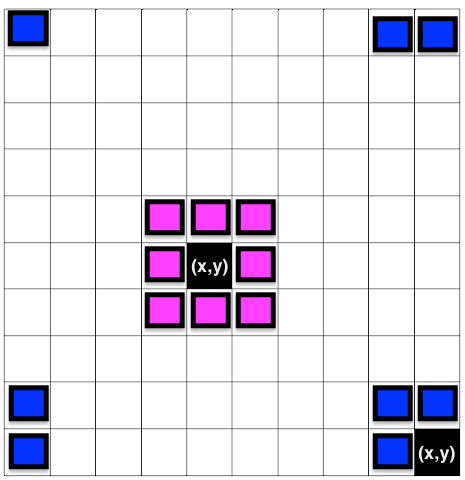

La pandemia del covid 19 que inició en diciembre del 2019 ha sido una pandemia que ha puesto en hacke a toda la humanidad. Tomando sorpresivamente a casi todas las naciones del mundo y solamente a unas pocas medianamente preparadas. Con las pérdidas económicas y cese de actividades lo más valioso que se ha llevado la pandemia ha sido las vidas humanas, pues este virus no conoce de política, religión o género. Entre las muchas vidas que se perdieron esta [Jhon Horton Conway](https://es.wikipedia.org/wiki/John_Horton_Conway) quien fue un prolífico matemático británico especialista en varias áreas de la matemática tales como la teoría de juegos, teoría de nudos, teoría de números.
Entre sus aportes matemáticos, destaca uno en el campo de los autómatas celulares bautizado como el "Juego de la Vida" o "Vida". Si bien es un juego tiene la particularidad que es de 0 jugadores, se rige por tres reglas muy sencillas y su evolución depende del estado inicial del juego.
Las reglas que rigen el juego son:

1. Cualquier célula viva con menos de dos vecinos o más de tres vecinos vivos muere, como por subpoblación o sobrepoblación correspondientemente.


2. Cualquier célula muerta con exactamente tres vecinos vivos se convierte en una célula viva, como por reproducción.


3. Cualquier célula viva con dos o tres vecinos vivos vive hasta la próxima generación.


El sistema es espacial y temporalmente discreto. Su evolución es en pasos discretos es decir el sistema tiene un estado para un tiempo `t=0` (que es el que nosotros definimos), luego el estado del sistema cambia en un tiempo `t=1` pero que depende del estado en `t=0`, el estado vuelve a cambiar en un tiempo `t=2` que depende del estado en `t=1` y así sucesivamente hasta un tiempo `t=n` , siendo `n` un número entero.


A primera vista no parece la gran cosa pero este sistema sencillo puede evolucionar en un sistema complejo con un comportamiento similar al de la evolución de la vida misma. Además en sí mismo este autómata celular es una máquina de touring, es decir que en él se puede implementar cualquier algoritmo que se derive de un problema matemático.


Por ejemplo se pueden programar relojes o salidas sencillas que muestren texto.


o incluso uno que simule el tejido del universo.


Si estas interesado en observar más patrones [aqui](https://conwaylife.appspot.com/library) puedes encontrar una larga biblioteca.

El observar como se crean sistemas complejos ha abierto investigaciones enfocadas en aplicaciones filosóficas: estas van desde la filosofía de la computación y el procesamiento de la información, hasta los relatos de reducción y surgimiento en la metafísica y la cognición, los debates sobre los fundamentos de la física, el libre albedrío, la naturaleza de la computación y la plausibilidad física de un mundo digital (es decir si es posible que vivamos en la matriz) 😝.

En fin, la teoria de automatas celular y sus aplicaciones es prometedora y demasiado basta así que sus detalles los obviamos. Entendida la belleza de este juego es hora de pasar a la implementación.

La idea que seguiremos es:

1. Crear una matriz con `nx` número de filas y `ny` número de columnas.
2. Los valores de la matriz serán 1 o 0 que significa vivo o muerto respectivamente.
3. Creamos una copia de la matriz.
4. Usando bucles recorremos la matriz y para cada celda calculamos el número de vecinos y aplicamos las reglas antes definidas.
5. El resultado de aplicar las reglas lo guardamos en la copia de la matriz del paso 3.
6. Los pasos 3, 4 y 5 se repiten el número de veces que deseamos usando un bucle (while o for).


**Manos a la obra !!!!**


La implementación del autómata es en lenguaje Python, empezamos por las librerías


```python
import pygame
import numpy as np
import matplotlib.pyplot as plt
import  time
```

La librería **numpy** nos servirá para crear una matriz de ceros y unos aleatorios, **matploblib** para graficar la evolución de la matriz en cada paso y **pygame** que nos servirá para implementar la lógica con un interfaz de usuario usando el teclado para pausar y salir del juego y el ratón para borrar o agregar el estado de una celda de la matriz. Ahora definamos el número de filas y columnas, en este caso son iguales formando un cuadrado.

```python
nx_cell = 30 #filas 
ny_cell = 30 #columnas
#Matriz de estados
state_game = np.random.randint(0, 2, (nx_cell, ny_cell)) 
print(state_game) #impresion en consola
plt.matshow(state_game) #grafico de la matriz de estados
plt.show()
```


Si todo a salido bien debería ver una grafico similar al de arriba, las celdas amarillas están vivas y las moradas están muertas.

Dentro de un `while` con condicion `True` (para que se repita indefinidamente) usando dos for anidados para acceder a cada celda calculamos el número de vecinos que rodean a una celda. Como cada celda toma el valor 0 o 1 entonces la suma de vecinos puede ser 0 como mínimo y 8 como máximo. Las coordenadas de los vecinos se presentan a continuación.


```python
while True:

    new_state_game = np.copy(state_game)

    for x in range(0, nx_cell):
        for y in range(0, ny_cell):

                n_vecinos = state_game[(x-1) % nx_cell, (y-1) % ny_cell ] + \
                            state_game[x % nx_cell, (y - 1) % ny_cell] + \
                            state_game[(x + 1) % nx_cell, (y - 1) % ny_cell] + \
                            state_game[(x - 1) % nx_cell, y % ny_cell] + \
                            state_game[(x + 1) % nx_cell, y % ny_cell] + \
                            state_game[(x - 1) % nx_cell, (y + 1) % ny_cell] + \
                            state_game[x % nx_cell, (y + 1) % ny_cell] + \
                            state_game[(x + 1) % nx_cell, (y + 1) % ny_cell] 

                ''' Una célula muerta con exactamente 3 células vecinas vivas "nace" (es decir, al turno siguiente estará viva
                    Si una célula viva tiene menos de 2 o mas de 3 células vecinas entonces muere ( por soledad o sobrepoblacion respectivamente)  
                '''

                if state_game[x, y] == 0 and n_vecinos == 3:
                    new_state_game[x, y] = 1
                elif state_game[x, y] == 1 and (n_vecinos < 2 or n_vecinos > 3):
                    new_state_game[x, y] = 0

            

    # Se actualiza el estado del juego
    state_game = np.copy( new_state_game)
    plt.matshow(state_game) # imprimir la matriz con los nuevos estados
    plt.show()
```
Si nos imaginamos a la matriz como una malla vamos a tener problemas con las celdas que se ubican en los bordes pues no podríamos definir todos sus vecinos. Para solucionar este problema trataremos a la malla como una superficie toroidal es decir que el final de la malla sea el inicio de la malla. Una superficie toroidal es como el video juego Pacman en el cual nuestro amiguito amarillo desaparecía por la izquierda y aparecia por la derecha, de manera similar si desaparece por arriba entonces aparecería por abajo. 


Entonces los vecinos para las celdas del centro (rosados) y de los bordes (azules) quedaria asi.



Si observa el código anterior accedemos a uno de los vecinos usando `state_game[(x + 1) % nx_cell, y % ny_cell]`, `%` representa la función resto y es la que nos permite tomar las celdas vecinas para celdas ubicadas en el borde. Por ejemplo basándonos en la imagen anterior , una malla de 10 x 10 en las que iniciamos el conteo de filas y columnas por 0, cuando `(x,y)=(9,0)`, sus vecinos:


1. `(x+1,y)=(10%10,0%10)=(0,0)`
2. `(x,y-1)=(9%10,-1%10)=(9,9)`
3. `(x+1,y-1)=(10%10,-1%10)=(0,9)`

Usted puede comprobar en la consola de python que 11%10 es igual a 1 y que -1%10 es 9.

Hasta este punto el algoritmo esta completamente implementado.

```python
'''GOL.py'''
import pygame
import numpy as np
import matplotlib.pyplot as plt
#import time


nx_cell = 30 #filas
ny_cell = 30 #columnas
#Matriz de estados
state_game = np.random.randint(0, 2, (nx_cell, ny_cell))
print(state_game) #impresion en consola
plt.matshow(state_game) #grafico de la matriz de estados
plt.show()

while True:

    new_state_game = np.copy(state_game)

    for x in range(0, nx_cell):
        for y in range(0, ny_cell):

            n_vecinos = state_game[(x - 1) % nx_cell, (y - 1) % ny_cell] + \
                        state_game[x % nx_cell, (y - 1) % ny_cell] + \
                        state_game[(x + 1) % nx_cell, (y - 1) % ny_cell] + \
                        state_game[(x - 1) % nx_cell, y % ny_cell] + \
                        state_game[(x + 1) % nx_cell, y % ny_cell] + \
                        state_game[(x - 1) % nx_cell, (y + 1) % ny_cell] + \
                        state_game[x % nx_cell, (y + 1) % ny_cell] + \
                        state_game[(x + 1) % nx_cell, (y + 1) % ny_cell]

            ''' Una célula muerta con exactamente 3 células vecinas vivas "nace" (es decir, al turno siguiente estará viva
                Si una célula viva tiene menos de 2 o mas de 3 células vecinas entoncesuere ( por soledad o sobrepoblacion respectivamente)  
            '''

            if state_game[x, y] == 0 and n_vecinos == 3:
                new_state_game[x, y] = 1
            elif state_game[x, y] == 1 and (n_vecinos < 2 or n_vecinos > 3):
                new_state_game[x, y] = 0

    # Se actualiza el estado del juego
    state_game = np.copy(new_state_game)
    plt.matshow(state_game)  # imprimir la matriz con los nuevos estados
    plt.show()

```
Si ejecuta el archivo GOL.py empezaran a abrirse ventanas con la imagen del estado de la matriz y estos aparecerán hasta que usted detenga manualmente la ejecución. Aunque el script es funcional, podríamos mejorarlo agregando una interfaz de usuario con atajos de teclado y ratón.

```python
import pygame
import numpy as np
import matplotlib.pyplot as plt
import  time

pygame.init()
size = width, height = 600, 600

bg = 25, 25, 25

nx_cell = 30
ny_cell = 30

nx_size = (width) / nx_cell
ny_size = (height) / ny_cell


screen = pygame.display.set_mode(size)

screen.fill(bg)

state_game = np.random.randint(0, 1, (nx_cell, ny_cell))


state_game[21, 19] = 1
state_game[21, 20] = 1
state_game[21, 21] = 1

print(state_game)
plt.matshow(state_game)

```

Una malla la podemos crear dibujando cuadrados sobre un plano cartesiano para lo cual es necesario tener las coordenadas de las esquinas de cada cuadrado que conforma la malla.


Entonces definimos parámetros para que el paquete pygame pueda dibujar:


* `pygame.init()` inicia los módulos importados de pygame

* `size = width, height = 600`, 600 es el tamaño en pixeles de la ventana

* `bg = 25, 25, 25` color de fondo de la ventana

* `nx_size = (width) / nx_cell` tamaño en pixeles del lado x del cuadrado

* `ny_size = (height) / ny_cell` tamaño en pixeles del lado y del cuadrado

* `screen = pygame.display.set_mode(size)` crea una ventana

* `screen.fill(bg)` asigna el color de fondo a la pantalla


Cuando ejecute el código anterior deberá abrirse una ventana de fondo negro. La malla la dibujamos aprovechando el `while` y `for` que creamos para recorrer la matriz de estados.

```python
PausaGame = False


while True:

    new_state_game = np.copy(state_game)
    screen.fill(bg)
    time.sleep(0.1)

    # Capturar eventos del teclado y raton

    ev = pygame.event.get()

    # print(pygame.KEYDOWN)

    for event in ev:
        if event.type == pygame.KEYDOWN:
            if event.key == pygame.K_ESCAPE:
                pygame.quit()
                break

            else:
                PausaGame = not PausaGame

        mouseClick = pygame.mouse.get_pressed()
        # print(mouseClick)

        if sum(mouseClick)> 0:
            posX, posY = pygame.mouse.get_pos()
            celdaX, celdaY = int(np.floor(posX/nx_size)), int(np.floor(posY/ny_size))
            new_state_game[celdaX, celdaY] = not mouseClick[2]


    for x in range(0, nx_cell):
        for y in range(0, ny_cell):

            if not PausaGame:
                n_vecinos = state_game[(x-1) % nx_cell, (y-1) % ny_cell ] + \
                            state_game[x % nx_cell, (y - 1) % ny_cell] + \
                            state_game[(x + 1) % nx_cell, (y - 1) % ny_cell] + \
                            state_game[(x - 1) % nx_cell, y % ny_cell] + \
                            state_game[(x + 1) % nx_cell, y % ny_cell] + \
                            state_game[(x - 1) % nx_cell, (y + 1) % ny_cell] + \
                            state_game[x % nx_cell, (y + 1) % ny_cell] + \
                            state_game[(x + 1) % nx_cell, (y + 1) % ny_cell] \

                #print(n_vecinos)

                # Una célula muerta con exactamente 3 células vecinas vivas "nace" (es decir, al turno siguiente estará viva)

                if state_game[x, y] == 0 and n_vecinos == 3:
                    new_state_game[x, y] = 1
                elif state_game[x, y] == 1 and (n_vecinos < 2 or n_vecinos > 3):
                    new_state_game[x, y] = 0

            poligonos = [((x) * nx_size, (y) * nx_size),
                         ((x+1) * nx_size, (y) * nx_size),
                         ((x+1)  * nx_size, (y+1) * ny_size),
                         ((x) * nx_size, (y+1) * ny_size)]  #coordenadas de los cuadros que crean la malla

            pygame.draw.polygon(screen, (128, 128, 128), poligonos, int(abs(1-new_state_game[x,y])))

    # Se actualiza el estado del juego
    state_game = np.copy( new_state_game)
    # plt.matshow(state_game)
    # plt.show()
    pygame.display.flip()

# fin del programa

```

* `PausaGame` nos sirve como variable auxiliar para pausar el juego.

* `time.sleep(0.1)` para que los cambios entre estado se demoren 0.1 ms y podamos observar mejor cómo evoluciona el sistema.

* `ev = pygame.event.get()` sirve para capturar eventos del teclado, es decir cuando se presione alguna tecla.

* `if event.type == pygame.KEYDOWN:` revisa si se presiona alguna tecla.

* `if event.key == pygame.K_ESCAPE:` cuando se ha presionado una tecla, esta linea de codigo pregunta si fue la tecla escape, si esto ha ocurrido entonces el juego se detiene de lo contrario se pausa.

* `mouseClick = pygame.mouse.get_pressed()` captura eventos del raton, es decir si se ha presionado alguno de los botones.

* `posX, posY = pygame.mouse.get_pos()` captura las coordenadas dentro de la ventana donde a dado un clic.

* `celdaX, celdaY = int(np.floor(posX/nx_size)),int(np.floor(posY/ny_size))` transforma las coordenas al numero de celda de la matriz de estados.

* `new_state_game[celdaX, celdaY] = not mouseClick[2]` cambia el estado de la celda con posiciones definidas en la línea anterior.

* `poligonos` son las coordenadas de los cuadrados que se dibujaran para crear la malla.

* `pygame.draw.polygon(screen, (128, 128, 128), poligonos, int(abs(1-new_state_game[x,y])))` dibuja los cuadrados de la malla.

* `pygame.display.flip()` actualiza los fotogramas en la ventana.

El resultado será


Puede pausar el juego presionando la barra espaciadora y salir del juego presionando la tecla de escape. También puede dibujar sobre la ventana, primero pause el juego y con el botón izquierdo del ratón pinte las celdas y con el botón derecho las borra.


El código completa se encuentra [aqui](https://github.com/DarwinCV/Juego-de-la-vida/blob/master/Juego_de_la_vida.py).

Si te pareció interesante o al menos entretenido, no olvides compartirlo. Gracias.
