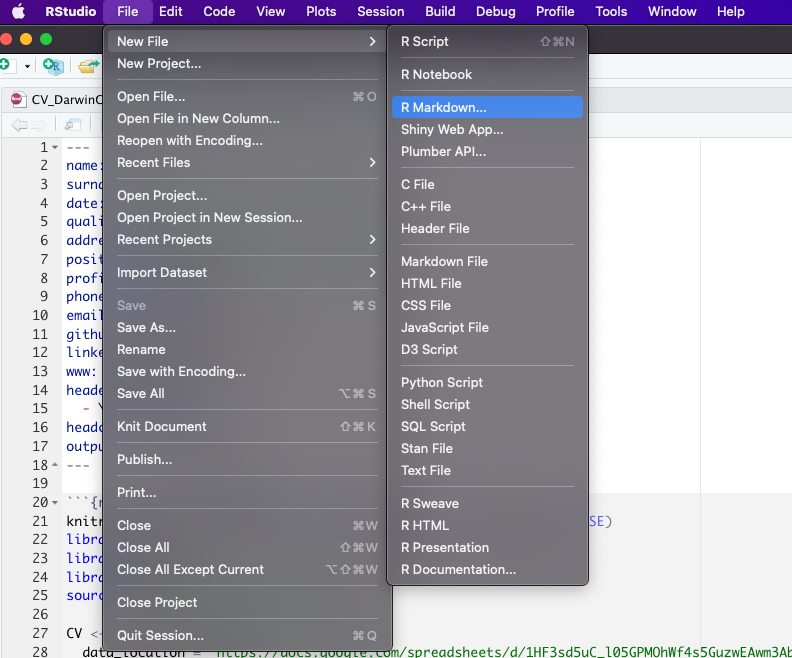
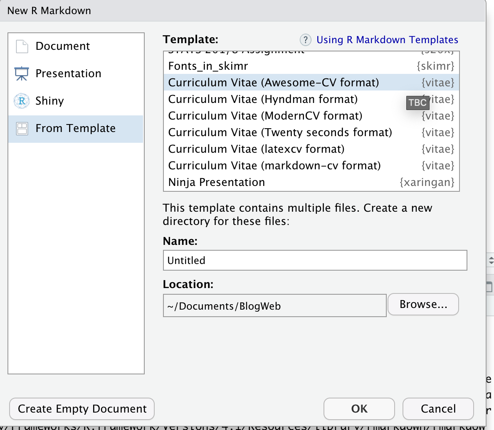
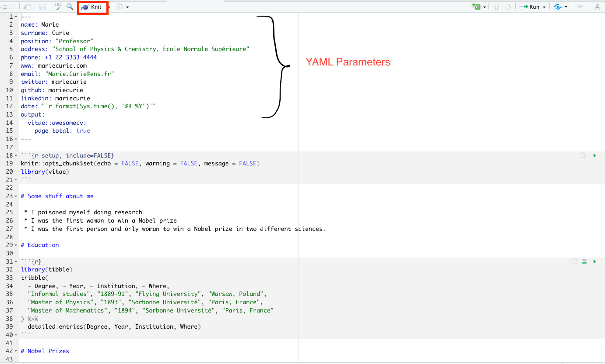
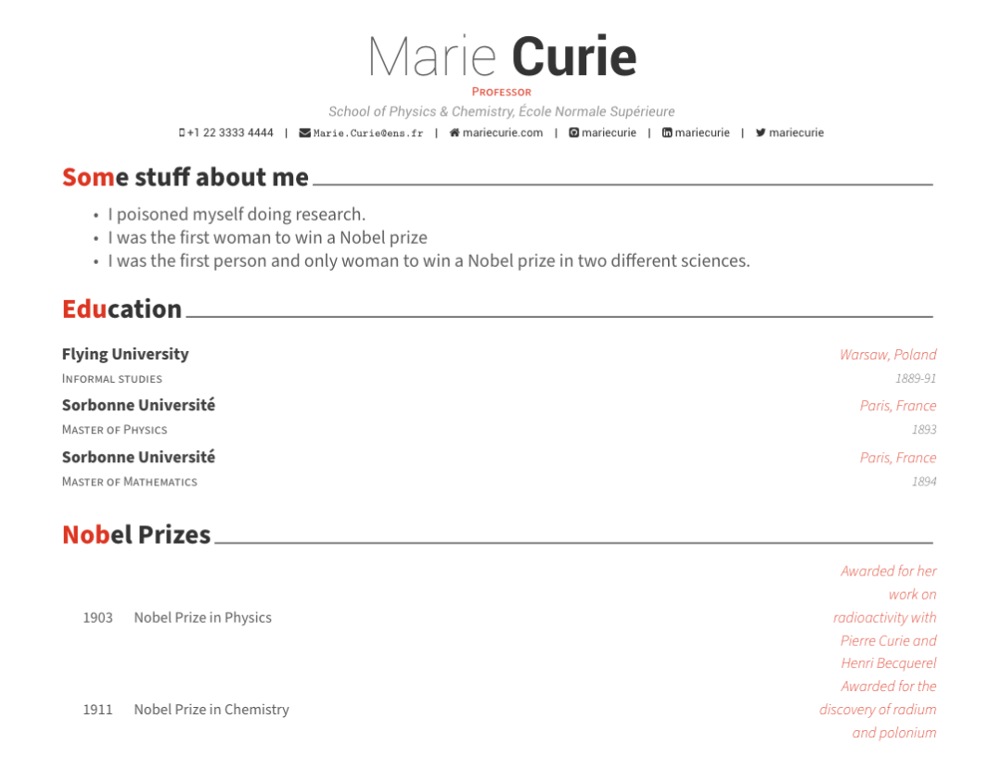
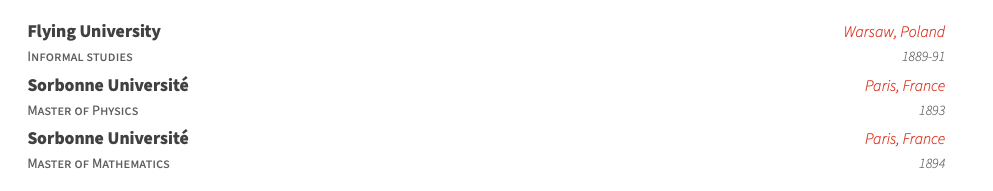
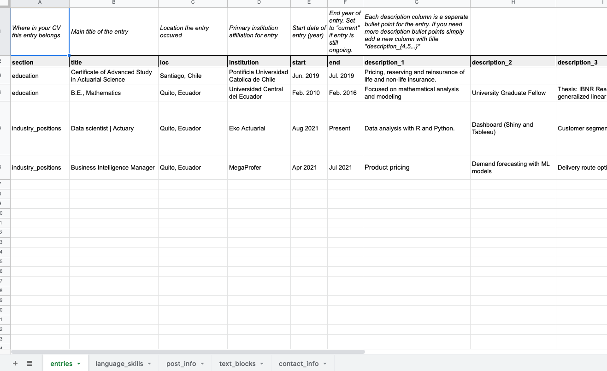

# CV en R

Al ingresar al mundo laboral o en la búsqueda de nuevas oportunidades de empleo todos  hemos estado en la tarea de crear o actualizar nuestro curriculum  y casi siempre la principal herramienta es Word seguido de Canva o Adobe ilustrator (para los mas avanzados). Las dos ultimas opciones si bien ofrecen mucha personalización en cuanto diseño no permiten tanta flexibilidad al momento de actualizar información o que se adapten facilmente a  un flujo de trabajo. Por otro lado Word tienen plantillas con diseños algo sosos y la lucha constante con las alineaciones, sangrados y estilos al momento de ingresar nueva información. 

Hace un par de años me enfrente a este problema y tuve la suerte de encontrar la solución en el paquete vitae desarrollado por [**Mitchell O'Hara-Wild**](https://github.com/mitchelloharawild/vitae). Este paquete permite crear un cv con 6 tipos de formato:

 1. Awesome-CV format
 2. Hydman
 3. ModernCV
 4. Twenty seconds
 5. latexcv
 6. markdown-cv

[Aquí](https://github.com/mitchelloharawild/vitae#examples-of-using-vitae) puede ver los ejemplos de los diferentes formatos junto con su código fuente. En los personal me agrada la plantilla Awesome-CV y de hecho todo este tutorial se desarrollada enfocada a este estilo de cv. 

Primero deberá crear un proyecto en Rstudio pues aprovecharemos el control de versiones git, en este [enlace](https://www.geo.uzh.ch/microsite/reproducible_research/post/rr-rstudio-git/#:~:text=In%20RStudio%20Select%20File%20%3E%20New,repository%20to%20your%20project%20folder) podrá encontrar el paso a paso de como crear un proyecto con control de versiones git. 

El primer paso será instalar el paquete vitae 

```r
install.packages("vitae")
```

y luego crear una plantilla de awesome cv con markdown



Esto creara la siguiente plantilla 


Para compilar deberá dar click en ‘Knit’  y tendrá el siguiente pdf


En los parámetros YAML puede especificar datos como nombre, posición, dirección, email, etc. [Aquí](https://cran.r-project.org/web/packages/vitae/vignettes/vitae.html) podrá encontrar más detalle acerca de cada parámetro disponible. 

Las datos para el cv se ingresan  en un tribble y se transforman a formato awesome con la función `detailed_entries()`  que tiene los parametros:

- data: tribble, tibble o dataframe con los datos
- what: nombre de la actividad o titulo
- when: fecha  de la actividad o titulo
- with: empresa o  institución
- where: lugar de la actividad o titulo
- why : para datos adicionales (estos pueden ser una lista de valores)

También existe  función `brief_entries(data, what, when, with, .protect = TRUE)`  que es similar pero con menos argumentos. Para mas informacion acerca de estas funciones puede escribir en la consola `?detailed_entries` o `?brief_entries` 

El siguiente código

```{r eval=FALSE}
tribble(
  ~ Degree, ~ Year, ~ Institution, ~ Where,
  "Informal studies", "1889-91", "Flying University", "Warsaw, Poland",
  "Master of Physics", "1893", "Sorbonne Université", "Paris, France",
  "Master of Mathematics", "1894", "Sorbonne Université", "Paris, France"
) %>% 
  detailed_entries(Degree, Year, Institution, Where)
```
al compilar a pdf creará  


Hasta este punto habra credo un cv funcional y no tendrá que preocuparse del diseño, sangrado o alineación del texto. Pero aun sigue siendo engorroso tener los datos y el código en el mismo lugar. Para resolver este problem tome como base el flujo de trabajo del paquete [datadrivencv](http://nickstrayer.me/datadrivencv/) creado por [Nick Strayer](https://github.com/nstrayer). 

## Guardar sus datos en Google sheets

Utilizaremos el paquete `googlesheets4` para descargar los datos de nuestro cv desde una hoja de calculo de Google. Sugiero copiar mi [hoja](https://docs.google.com/spreadsheets/d/1AN85IIvbcMnGbcOCX3jurB4fMOp_niAUbDBU_zfjFEw/edit?usp=sharing) y reemplazar sus datos.

El documento tiene las siguientes:

 1. entries: información acerca de educación, experiencia laboral, certificaciones, etc.
 2. lenguaje_skills: herramientas o habilidades que maneja.
 3. post_info: informacion acerca de post.
 4. text_block: informacion adicional como su descripción profesional o intereses.
 5. contact_info: información de contacto (email, teléfono, etc)

## Crear funciones personalizadas

La siguiente función permite crear un objeto con toda la información de la hoja de calculo, 

 1. data_location: es el link de la hoja de calculo de google sheet
 2. pdf_mode: si es TRUE se eliminan los link de los textos.
 3. sheet_is_publicly_readable: TRUE si el link de la hoja de calculo es público

```{r eval=FALSE}
create_CV_object <-  function(data_location,
                              pdf_mode = FALSE,
                              sheet_is_publicly_readable = TRUE) {
  
  cv <- list(
    pdf_mode = pdf_mode,
    links = c()
  )
  
  is_google_sheets_location <- stringr::str_detect(data_location, "docs\\.google\\.com")
  
  if(is_google_sheets_location){
    if(sheet_is_publicly_readable){
      # This tells google sheets to not try and authenticate. Note that this will only
      # work if your sheet has sharing set to "anyone with link can view"
      googlesheets4::gs4_deauth()
    } else {
      # My info is in a public sheet so there's no need to do authentication but if you want
      # to use a private sheet, then this is the way you need to do it.
      # designate project-specific cache so we can render Rmd without problems
      options(gargle_oauth_cache = ".secrets")
    }
    
    read_gsheet <- function(sheet_id){
      googlesheets4::read_sheet(data_location, sheet = sheet_id, skip = 1, col_types = "c")
    }
    cv$entries_data  <- read_gsheet(sheet_id = "entries")
    cv$skills        <- read_gsheet(sheet_id = "language_skills")
    cv$text_blocks   <- read_gsheet(sheet_id = "text_blocks")
    cv$contact_info  <- read_gsheet(sheet_id = "contact_info")
    cv$post_info  <- read_gsheet(sheet_id = "post_info")
  } else {
    # Want to go old-school with csvs?
    cv$entries_data <- readr::read_csv(paste0(data_location, "entries.csv"), skip = 1)
    cv$skills       <- readr::read_csv(paste0(data_location, "language_skills.csv"), skip = 1)
    cv$text_blocks  <- readr::read_csv(paste0(data_location, "text_blocks.csv"), skip = 1)
    cv$contact_info <- readr::read_csv(paste0(data_location, "contact_info.csv"), skip = 1)
    cv$post_info <- readr::read_csv(paste0(data_location, "post_info.csv"), skip = 1)
  }
  
  
  extract_year <- function(dates){
    date_year <- stringr::str_extract(dates, "(20|19)[0-9]{2}")
    date_year[is.na(date_year)] <- lubridate::year(lubridate::ymd(Sys.Date())) + 10
    
    date_year
  }
  
  parse_dates <- function(dates){
    
    date_month <- stringr::str_extract(dates, "(\\w+|\\d+)(?=(\\s|\\/|-)(20|19)[0-9]{2})")
    date_month[is.na(date_month)] <- "1"
    
    paste("1", date_month, extract_year(dates), sep = "-") %>%
      lubridate::dmy()
  }
  
  # Clean up entries dataframe to format we need it for printing
  cv$entries_data %<>%
    tidyr::unite(
      tidyr::starts_with('description'),
      col = "description_bullets",
      sep = "\n- ",
      na.rm = TRUE
    ) %>%
    dplyr::mutate(description_bullets = as.list(strsplit(description_bullets , "\n- ")) ) %>% 
    dplyr::mutate(
      # description_bullets = ifelse(description_bullets != "", paste0("- ", description_bullets), ""),
      start = ifelse(start == "NULL", NA, start),
      end = ifelse(end == "NULL", NA, end),
      start_year = extract_year(start),
      end_year = extract_year(end),
      no_start = is.na(start),
      has_start = !no_start,
      no_end = is.na(end),
      has_end = !no_end,
      timeline = dplyr::case_when(
        no_start  & no_end  ~ "N/A",
        no_start  & has_end ~ as.character(end),
        has_start & no_end  ~ paste("Current", "-", start),
        TRUE                ~ paste(end, "-", start)
      )
    ) %>%
    dplyr::arrange(desc(parse_dates(end))) %>%
    dplyr::mutate_all(~ ifelse(is.na(.), 'N/A', .))
  
  cv
}
```

Esta función elimina los links de un texto 

```{r eval=FALSE}
sanitize_links <- function(cv, text){
  if(cv$pdf_mode){
    link_titles <- stringr::str_extract_all(text, '(?<=\\[).+?(?=\\])')[[1]]
    link_destinations <- stringr::str_extract_all(text, '(?<=\\().+?(?=\\))')[[1]]
    
    n_links <- length(cv$links)
    n_new_links <- length(link_titles)
    
    if(n_new_links > 0){
      # add links to links array
      cv$links <- c(cv$links, link_destinations)
      
      # Build map of link destination to superscript
      link_superscript_mappings <- purrr::set_names(
        paste0("<sup>", (1:n_new_links) + n_links, "</sup>"),
        paste0("(", link_destinations, ")")
      )
      
      # Replace the link destination and remove square brackets for title
      text <- text %>%
        stringr::str_replace_all(stringr::fixed(link_superscript_mappings)) %>%
        stringr::str_replace_all('\\[(.+?)\\]', "\\1")
    }
  }
  
  list(cv = cv, text = text)
}

```

También se necesita funciones para imprimir los datos descargados

```{r eval=FALSE}
# print text block
print_text_block <- function(cv, label){
  text_block <- dplyr::filter(cv$text_blocks, loc == label) %>%
    dplyr::pull(text)
  
  strip_res <- sanitize_links(cv, text_block)
  
  cat(strip_res$text)
  
  invisible(strip_res$cv)
}

# print table of skills
print_skill <- function(cv){
  
  glue_template <- "
\\cvskill{<<group>>}{<<skills>>}"
  
  skills_formatted <- cv$skills %>%
    mutate(skill = if_else(is.na(details)|details=="", glue::glue("{skill}"), glue::glue("{skill} ({details})"))) %>% 
    group_by(group) %>% 
    summarize(skills = glue::glue_collapse(skill, sep = ", ")) 
  
  cv_skill <- skills_formatted %>% 
    glue::glue_data(glue_template, .open = "<<", .close = ">>" ) %>% 
    paste0(., collapse = '\n')
  
  cv_skill_env <- paste0('\n\\begin{cvskills}\n', cv_skill, '\n\\end{cvskills}\n' , collapse= '\n')
  
  cat(cv_skill_env)
  
  invisible(cv)
}

# print table of posts
print_post<- function(cv, glue_template = "default"){
  
  if(glue_template == "default"){
    glue_template <- "
- [{name}]({link})
\n"
  }  
  print(glue::glue_data(cv$post_info , glue_template))
  
  invisible(cv)
}
```

Bien, ahora reemplacemos

```{r eval=FALSE}
knitr::opts_chunk$set(echo = FALSE, warning = FALSE, message = FALSE)
library(vitae)
```
por esto, para poder usar las funciones anteriores

```{r eval=FALSE}
knitr::opts_chunk$set(echo = FALSE, warning = FALSE, message = FALSE)
library(vitae)
library(dplyr)
library(magrittr)
source("Utils/data_download_funs.R")

CV <- create_CV_object(
  data_location = "https://docs.google.com/spreadsheets/d/19YWFjpiCqTbrwrU1hpxDNubZKoNi-o0DvOQbcHqsc7c/edit?usp=sharing",  
  pdf_mode = FALSE
)
```

Para la sección de Educación  podemos reemplazar 

```{r eval=FALSE}
library(tibble)
tribble(
  ~ Degree, ~ Year, ~ Institution, ~ Where,
  "Informal studies", "1889-91", "Flying University", "Warsaw, Poland",
  "Master of Physics", "1893", "Sorbonne Université", "Paris, France",
  "Master of Mathematics", "1894", "Sorbonne Université", "Paris, France"
) %>% 
  detailed_entries(what = Degree, when = Year, with = Institution, where = Where)
```

por

```{r eval=FALSE}
CV$entries_data %>% 
  filter(section == 'education') %>% 
  detailed_entries(
    what = institution,
    when = glue::glue("{`start`} - {`end`}"),
    with = title,
    where = loc,
    why = description_bullets
  )
```


Para imprimir sus habilidades

```{r eval=FALSE}
CV %>% print_skill()
```

Para imprimir sus posts

```{r eval=FALSE}
CV %<>% print_post()
```

Todos los archivos se encuentran alojado [aquí ](https://github.com/DarwinCV/automated-CV).

Quiero agredecer a **Nick Strayer** y **Mitchell O'Hara-Wild**  por el maravilloso trabajo realizado en el paquete vitae y datadrivencv.


